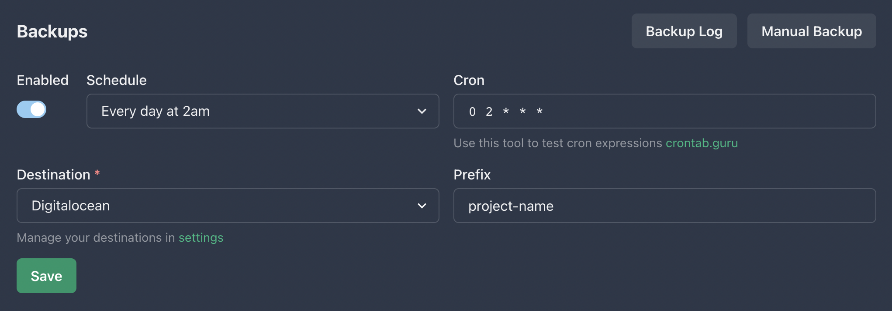

Hey, hello, welcome to Chronify!. I'm super excited for this project that I think that can bring a lot of value to the community. I'm going to try to keep this post short and sweet, but I want to give you a little bit of context about what Chronify is and what it's going to be.

## What is Chronify?

Technically speaking, Chronify is a solution that allows you to schedule triggers to any HTTP Webhook. This means that you can schedule a trigger for any webhook that you want, and Chronify will make sure that it's triggered at specific intervals that you can define. This is a very powerful tool that can be used for a lot of different things, and I'll try to give you a few examples of what you can do with it.

Personal speaking, Chronify is the result of my frustration dealing with the lack of a <b>simple</b> scheduling solution for webhooks. If I have a function that I want to run every 5 minutes, I can't just schedule it to run every 5 minutes, I need to deal with service accounts, authorizations, internal or external traffice allowance, learning whats the logic behind the scheduler or the other components that I need to understand to use it and I can imagine thats a very common problem, and I'm sure that you've dealt with it before. <b>Chronify</b> is my attempt to solve this problem.

## What can I do with Chronify?

Let me give you a few examples of what you can do with Chronify:

- You can schedule a trigger for a webhook allows you run a cloud function every X amount of minutes.
- You can schedule an action for a webhook allows you to automate some tasks that you used to do manually. For example, backup your databases every 24 hours, clean up your logs every 7 days, etc.
- I'm using Chronify to schedule a trigger to a push notification remind me to drink water every 2 hours. I'm also using it to remind me to take my vitamins every day at 8:00 AM.
- You can use Chronify to schedule a trigger to a webhook that will send you a notification when a specific event happens. For example, you can schedule a trigger to a webhook that will send you a notification when a new post is published on your blog.
- Chronify is a API first solution, that's mean that you can create your task with dynamic information that you get from other API or systems.

These are just a few examples of what you can do with Chronify, but I'm sure that you can come up with a lot of other use cases. Stay tuned to this blog and the documentation to see more examples of what you can do with Chronify.

## How much does it cost?

Chronify is free to use, with the <b>free</b> plan you can schedule up to 5 tasks/triggers. For now this is the only plan that we have, but we're working on a paid plan that will allow you to schedule more tasks with more features.

## How can I get started?

You can get started with Chronify by creating an account through our API. Please, check the [documentation](https://chronofy.dev/docs) for more information about how to create an account, confirm your email address and login to your account.

## What's next?

The future is bright for Chronify, we have a lot of features that we want to add to the platform, and we're going to be working hard to make sure that we can deliver them as soon as possible. Here are some of the features that we're working on (with more to come!):

- [ ] Add support for more time intervals. Right now Chronify only supports minutes, but we want to add support for hours, days, weeks, months and years.
- [ ] Add support for more timezones. Right now Chronify only supports UTC, but we want to add support for more timezones.
- [ ] Add support for more webhook methods. Right now Chronify only supports GET and POST, but we want to add support for PUT, PATCH and DELETE.
- [ ] Add support for more webhook content types. Right now Chronify only supports JSON, but we want to add support for more content types.
- [ ] Add notification system. We want to add a notification system that will allow you to receive notifications when a task is triggered and the result of the trigger.

## How can I get in touch?

If you have any questions, comments or suggestions, please, feel free to reach out to me on [Twitter](https://twitter.com/hectorivand). You can also join our to Slack server to get in touch with the community and the team 👇

- [Ignacio on Mastodon](https://mastodon.social/@ignaciovdk)
- [Chronify on Mastodon](https://mastodon.social/@chronify)
- [Chronify on Slack](https://join.slack.com/t/chronifycommunity/shared_invite/zt-1qnkurg5h-lCrxGbmcn2Dle1HjAjbgYg)

Thanks for reading, and I hope that you enjoy Chronify as much as I do building it. See you next time!